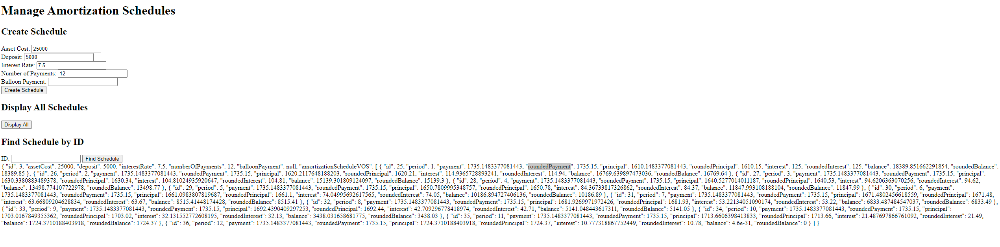

# Amortization Schedule Service
This project is a Spring Boot application that provides an API for creating and retrieving amortization schedules.

## Getting Started
These instructions will get the project up and running on your local machine for development and testing.

## Prerequisites
Java JDK 17 
Gradle (if not using the Gradle Wrapper)

# Building the Project
To build the project, navigate to the root directory of the project and run:
```sh
./gradlew clean build
```
If you are on Windows, use:
```sh
gradlew.bat clean build
```

# Running the Application
To start the application, run:
```sh
./gradlew bootRun
```
For Windows:
```sh
gradlew.bat bootRun
```

The application will start and by default listen on http://localhost:8080.

# Testing the API
You can test the API using the following simple web interface or cURL commands:

## Accessing the Web Interface
Navigate to http://localhost:8080/ to access the management page



### Features 

- Create Amortization Schedule: Allows the user to input details such as asset cost, deposit, interest rate, number of payments, and an optional balloon payment to create a new amortization schedule.

- Display All Schedules: Display all existing amortization schedules. 

- Find Schedule by ID: Users can enter the ID of a specific amortization schedule to retrieve its details.

### API Response Structure

The `ScheduleRecordVO` content the user input required for generating the breakdown of amortization schedules.
it includes all details such as the `asset cost`, `deposit`, `interest rate`, `number of payments`, and an optional `balloon payment`. It will contain a list of `amortizationScheduleVOS`

`amortizationScheduleVOS` is the breakdown of the Amortization Schedules, detailing each payment period's raw and rounded figures.
- `payment`, `principal`, `interest`, `balance`: These are the raw numbers without rounding. They provide the exact calculated values based on the amortization formula.

- `roundedPayment`, `roundedPrincipal`, `roundedInterest`, `roundedBalance`: These fields contain rounded numbers. These are the values that should match the expected result.


## cURL commands
### For Unix/Linux/macOS:
Create an Amortization Schedule
```sh
curl -X POST http://localhost:8080/service/amortization-schedules/ \
-H "Content-Type: application/json" \
-d '{
  "assetCost": 20000,
  "deposit": 5000,
  "interestRate": 5,
  "numberOfPayments": 12,
  "balloonPayment": 10000
}'
```
Get All Amortization Schedules
```sh
curl -X GET http://localhost:8080/service/amortization-schedules/ \
-H "Accept: application/json"
```
Get Amortization Schedule by ID
Replace 1 with the ID of the amortization schedule you wish to retrieve.

```sh
curl -X GET http://localhost:8080/service/amortization-schedules/1 \
-H "Accept: application/json"
```

### For Windows CMD:

Create an Amortization Schedule
```sh
curl -X POST http://localhost:8080/service/amortization-schedules/ -H "Content-Type: application/json" -d "{\"assetCost\": 20000,\"deposit\": 5000,\"interestRate\": 5,\"numberOfPayments\": 12,\"balloonPayment\": 10000}"
```

Get All Amortization Schedules
```sh
curl -X GET http://localhost:8080/service/amortization-schedules/ -H "Accept: application/json"
```

Get All Amortization Schedules
```sh
curl -X GET http://localhost:8080/service/amortization-schedules/1 -H "Accept: application/json"
```